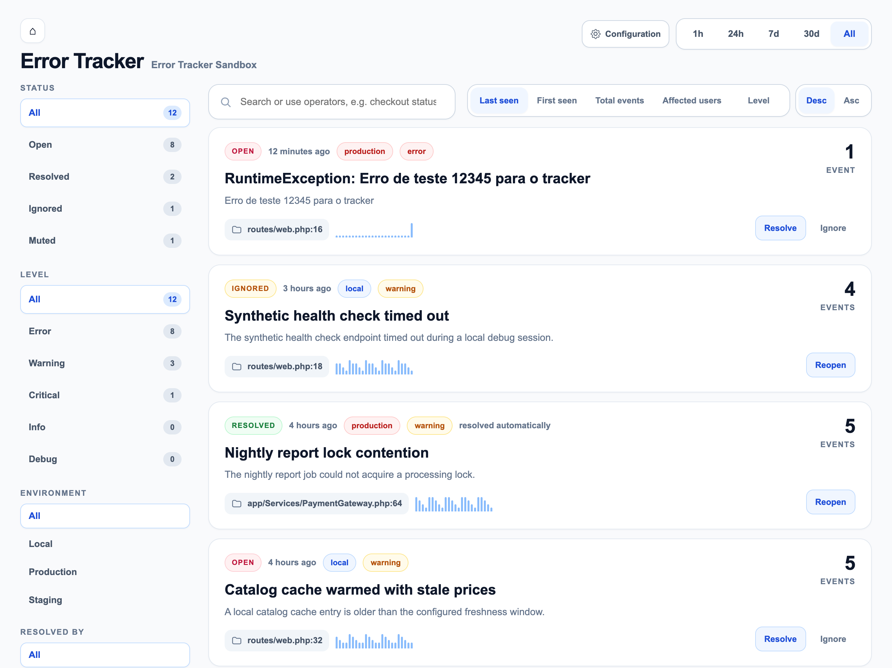
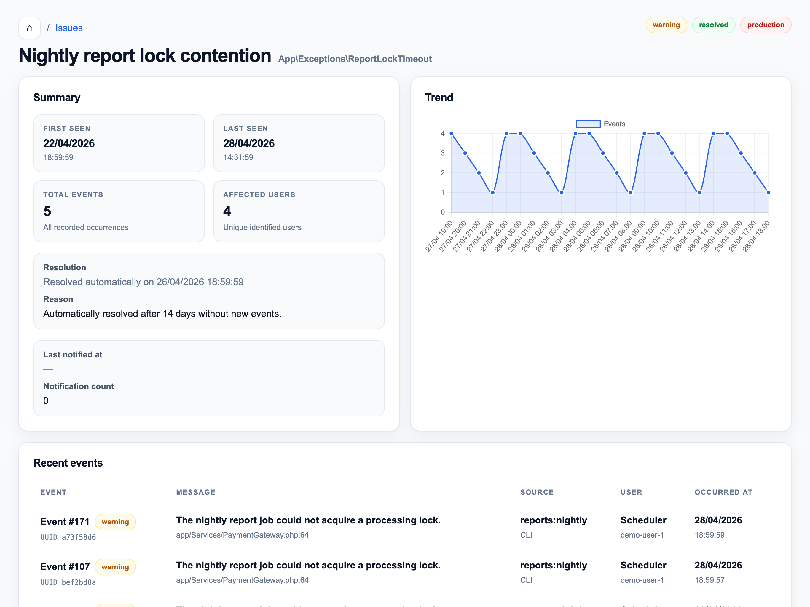
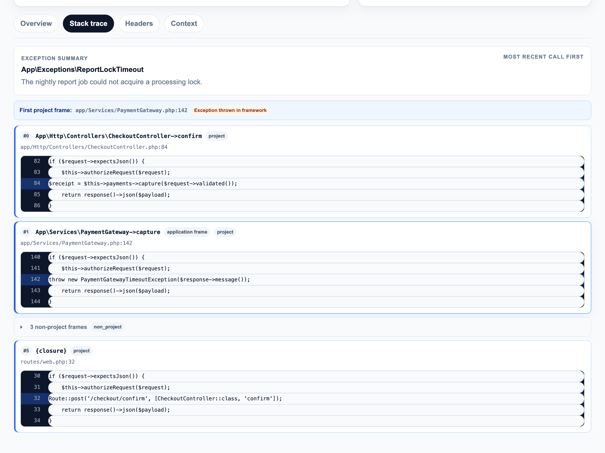
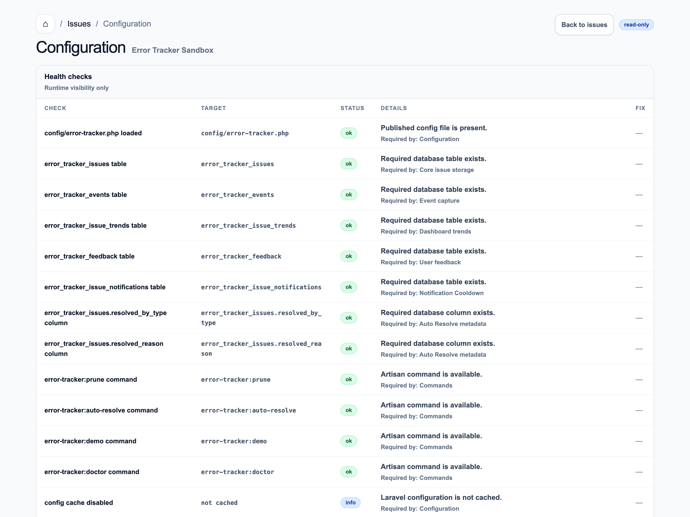

# Laravel Error Tracker

[](https://github.com/hewerthomn/laravel-error-tracker/actions/workflows/ci.yml)
[](LICENSE)
[](composer.json)
[](composer.json)
[](https://laravel.com/docs/pint)

A Laravel-first error tracking package with a built-in dashboard, local
persistence, issue grouping, notifications, smart stack traces, diagnostics,
and optional end-user feedback.

## Documentation

Full documentation is available at:

https://hewerthomn.com/laravel-error-tracker/

The README contains the quick start. The documentation site contains the full guide.

## Features

### Capture and storage

- Exception capture through Laravel's exception pipeline.
- Local database storage inside the project or in a shared external database.
- Issue grouping by fingerprint.
- Hourly trend aggregation.
- Optional shared tracker database connection for multiple applications or environments.

### Dashboard and search

- Dashboard with grouped issues, filters, issue detail, and event detail.
- Advanced search with shareable GET query parameters.
- Configurable dashboard navigation back to the host application.
- Smart stack trace grouping with project frame highlighting.

### Issue workflow

- Resolve, reopen, ignore, mute, and unmute issues.
- Optional auto resolve for stale open issues.

### Notifications

- Mail and Slack notifications for new and reactivated issues.
- Optional notification cooldown to reduce noisy alerts.

### Feedback and error page

- Optional custom production error page.
- Optional end-user feedback form linked to recorded events.

### Diagnostics and maintenance

- Configuration diagnostics for capture, feedback, notifications, stack trace,
  retention, redaction, and database health checks.
- Prune, auto resolve, demo data, and doctor Artisan commands.

## Screenshots

### Issues dashboard



### Issue detail



### Smart stack trace



### Configuration diagnostics



## Requirements

- PHP 8.3+
- Laravel 11, 12, or 13
- A relational database supported by Laravel

## Installation

### Default install

Install the package in your Laravel application, publish configuration and
migrations, run migrations, and verify the setup:

```bash
composer require hewerthomn/laravel-error-tracker
php artisan error-tracker:install
php artisan migrate
php artisan error-tracker:doctor
```

The default installer is non-destructive. It publishes the package config and
migrations, optionally asks to run migrations in interactive terminals, and
prints the next recommended commands.

To generate demo data at the end of installation:

```bash
php artisan error-tracker:install --with-demo
```

### Guided install

```bash
php artisan error-tracker:install --guided
```

The guided installer can suggest the main `.env` values for feedback, custom
error pages, auto resolve, notifications, notification cooldown, smart stack
trace, and database connection.

It does not edit `config/error-tracker.php` directly. To write missing `.env`
values idempotently, pass `--write-env`.

### Presets

```bash
php artisan error-tracker:install --preset=local
php artisan error-tracker:install --preset=production
php artisan error-tracker:install --preset=minimal
php artisan error-tracker:install --preset=demo
```

Available presets:

- `minimal`: feedback off, notifications off, auto resolve off, custom error
  page off, smart stack trace on.
- `local`: feedback on, notifications off, auto resolve off, custom error page
  on, smart stack trace on.
- `production`: feedback on, notifications on, auto resolve off, custom error
  page on, smart stack trace on, notification cooldown on.
- `demo`: feedback on, notifications off, auto resolve on, custom error page
  on, smart stack trace on, and demo data generation enabled.

## Updating the package

New Error Tracker features can add database migrations. After updating the
package, publish any new migrations, run them, clear optimized config, and run
diagnostics:

```bash
composer update hewerthomn/laravel-error-tracker -W
php artisan vendor:publish --tag=error-tracker-migrations
php artisan migrate
php artisan optimize:clear
php artisan error-tracker:doctor
```

Examples of features that add schema are Auto Resolve metadata and Notification Cooldown history.

## Basic Setup

### Define the dashboard gate

In your host application, define the `viewErrorTracker` gate:

```php
use Illuminate\Support\Facades\Gate;

Gate::define('viewErrorTracker', function ($user = null) {
    return true;
});
```

Replace the example above with your real authorization logic.

### Minimal exception capture

Register exception capture in `bootstrap/app.php`:

```php
use Hewerthomn\ErrorTracker\Actions\RecordThrowableAction;
use Illuminate\Foundation\Configuration\Exceptions;

->withExceptions(function (Exceptions $exceptions): void {
    $exceptions->dontReportDuplicates();

    $exceptions->report(function (\Throwable $e) {
        app(RecordThrowableAction::class)->handle($e);
    });
})
```

See [Custom Error Page and User Feedback](#custom-error-page-and-user-feedback)
for a fuller `bootstrap/app.php` example that records the exception and renders
the optional production error page with feedback.

## Dashboard

By default, the dashboard is available at:

```text
/error-tracker
```

The page title uses:

```text
Error Tracker - {APP_NAME}
```

The dashboard also supports a configurable shortcut back to the host application.

### Dashboard quick filters

The issues dashboard includes a left sidebar with quick filters for status,
level, period, and environment.

The main issue list includes search for errors, paths, or messages, plus sorting
by recent, frequent, or oldest issues. Filter links preserve the current query
string, and status and level filters show counts for the current dashboard
slice.

### Diagnostics page

The read-only diagnostics page is available at:

```text
/error-tracker/configuration
```

If you customize `error-tracker.route.path`, the page follows that path, for
example `/{custom-path}/configuration`.

The page shows the effective Error Tracker configuration for capture, feedback,
auto resolve, notifications, stack trace, retention, redaction, and database
health checks. It also shows command and scheduler hints for maintenance tasks.

Secrets are never displayed raw. Notification recipients, Slack webhook values,
tokens, secrets, passwords, authorization headers, cookies, and API keys are
rendered as `configured` or `not configured`.

## Configuration

Main configuration file:

```text
config/error-tracker.php
```

Important options include:

- `database.connection`
- `route.path`
- `dashboard.app_home_url`
- `capture.sample_rate`
- `fingerprint.include_environment`
- `notifications.channels`
- `notifications.cooldown_minutes`
- `notifications.max_per_issue_per_hour`
- `error_page.enabled`
- `feedback.enabled`
- `retention.events_days`
- `auto_resolve.enabled`
- `auto_resolve.after_days`
- `stacktrace.smart_grouping`
- `stacktrace.project_paths`
- `stacktrace.project_namespaces`
- `stacktrace.non_project_paths`
- `stacktrace.path_display`
- `stacktrace.store_absolute_paths`
- `stacktrace.source_context`
- `stacktrace.store_arguments`

## Advanced search

The dashboard index uses GET query parameters, so filtered views can be shared or bookmarked:

```text
/error-tracker?q=checkout%20status:open%20level:error&period=24h&sort=last_seen_at&direction=desc
```

The search box accepts free text plus operators.

Free text searches issue title, exception class, message sample, fingerprint,
status, level, environment, and resolution metadata. Event and feedback tables
are only queried when an operator requires them.

Supported operators:

```text
status:open
status:resolved
level:error
level:critical
env:production
environment:staging
class:QueryException
exception:QueryException
message:timeout
fingerprint:abc123
route:users.store
path:/api/users
url:example.com
file:UserController.php
user:123
status_code:500
resolved:auto
resolved:manual
has:feedback
```

Values with spaces can be quoted:

```text
message:"checkout timeout" status:open
```

The visual filters cover status, level, environment, period, resolution type,
feedback presence, sort, and direction.

Active filters are shown as chips, and the Clear filters action returns to
`/error-tracker` without query parameters. Inputs are validated against allowed
values and applied through Eloquent query builder methods rather than raw SQL.

## Smart Stack Trace

The event detail page highlights frames that belong to your project and groups
consecutive framework, vendor, internal, or unknown frames into collapsed
non-project blocks.

This keeps the most useful application code visible while still allowing
framework/vendor details to be expanded when needed.

By default, project frames are detected from common Laravel paths and namespaces:

```php
'stacktrace' => [
    'smart_grouping' => true,
    'project_paths' => [
        app_path(),
        base_path('routes'),
        base_path('database'),
        base_path('config'),
        base_path('packages'),
        base_path('modules'),
    ],
    'project_namespaces' => [
        'App\\',
        'Database\\',
    ],
    'non_project_paths' => [
        base_path('vendor'),
        base_path('storage/framework'),
        base_path('bootstrap/cache'),
    ],
    'collapse_non_project_frames' => true,
    'show_source_context' => true,
    'source_context_lines' => 5,
    'path_display' => env('ERROR_TRACKER_STACKTRACE_PATH_DISPLAY', 'relative'),
    'store_absolute_paths' => env('ERROR_TRACKER_STACKTRACE_STORE_ABSOLUTE_PATHS', false),
    'source_context' => [
        'enabled' => env('ERROR_TRACKER_SOURCE_CONTEXT_ENABLED', true),
        'lines_before' => 5,
        'lines_after' => 5,
        'max_frames' => 5,
        'project_only' => true,
        'fallback_to_throwing_frame' => true,
        'max_file_size_kb' => 512,
        'paths' => [
            app_path(),
            base_path('routes'),
            base_path('database'),
            base_path('config'),
            base_path('packages'),
            base_path('modules'),
        ],
        'excluded_paths' => [
            base_path('vendor'),
            storage_path(),
            base_path('bootstrap/cache'),
        ],
    ],
    'store_arguments' => false,
],
```

Function arguments are not stored or displayed by default for security.

Old traces that contain `args` or `arguments` are ignored by the presenter.
Source context is only read from configured `stacktrace.project_paths`, never
from `vendor` by default, and source lines containing tokens, passwords,
secrets, authorization values, cookies, or `x-api-key` are masked before
display.

## Path normalization and source context

Error Tracker normalizes stack trace paths by default before storing or displaying them.

Absolute paths such as `/workspace/app/routes/web.php` are stored as
`routes/web.php`, which avoids leaking server directory structure in the
database or dashboard.

`stacktrace.path_display` accepts `relative`, `basename`, and `absolute`. The default is `relative`.

If `path_display` is set to `absolute` but `stacktrace.store_absolute_paths` is
`false`, Error Tracker falls back to relative paths for safety.

Source context is enabled by default and stores a small snippet around eligible
project stack frames.

When an exception is thrown inside Laravel or another dependency, Error Tracker
marks the first project frame closest to the top of the stack as the application
frame and uses that frame for the event location and primary source context. The
original throwing frame is still kept in the stack trace and labeled separately
when it comes from the framework.

Source context is limited to configured project paths, skips excluded paths such
as `vendor`, `storage`, and `bootstrap/cache`, enforces a maximum file size, and
does not read `.env`.

Missing or unreadable files simply return no context, so the dashboard keeps
rendering. The dashboard escapes source lines when rendering them.

Available source context settings:

```php
'source_context' => [
    'enabled' => env('ERROR_TRACKER_SOURCE_CONTEXT_ENABLED', true),
    'lines_before' => 5,
    'lines_after' => 5,
    'max_frames' => 5,
    'project_only' => true,
    'fallback_to_throwing_frame' => true,
    'max_file_size_kb' => 512,
    'paths' => [
        app_path(),
        base_path('routes'),
        base_path('database'),
        base_path('config'),
        base_path('packages'),
        base_path('modules'),
    ],
    'excluded_paths' => [
        base_path('vendor'),
        storage_path(),
        base_path('bootstrap/cache'),
    ],
],
```

## Auto Resolve

Auto Resolve can close stale open issues when they have not received new events
for a configured number of days.

The feature is disabled by default.

Default configuration:

```php
'auto_resolve' => [
    'enabled' => env('ERROR_TRACKER_AUTO_RESOLVE_ENABLED', false),
    'after_days' => env('ERROR_TRACKER_AUTO_RESOLVE_AFTER_DAYS', 14),
    'statuses' => ['open'],
    'levels' => ['warning', 'error'],
    'environments' => null,
    'reason' => 'Automatically resolved after :days days without new events.',
],
```

Example scheduler registration:

```php
use Illuminate\Support\Facades\Schedule;

Schedule::command('error-tracker:auto-resolve')->daily();
```

Preview eligible issues without changing the database:

```bash
php artisan error-tracker:auto-resolve --dry-run
```

## Shared Database / Multi-App Setup

The package can optionally use a dedicated database connection:

```php
'database' => [
    'connection' => env('ERROR_TRACKER_DB_CONNECTION'),
],
```

When this is configured, multiple applications may write to the same tracker storage.

In that setup, keeping `environment` visible in the dashboard and optionally
including it in the fingerprint becomes more useful.

## Notifications

Supported in the current MVP:

- Mail
- Slack

Mail notifications can be configured with:

```env
ERROR_TRACKER_MAIL_TO=alerts@example.test
```

Slack delivery is optional and depends on Laravel's Slack notification channel
setup in the host application.

## Notification Cooldown

Notification cooldown prevents a noisy issue from sending too many mail or Slack
alerts in a short period.

The limiter is applied per issue and covers notifications for:

- `new_issue`
- `regression`
- `reactivated`

Default settings:

```env
ERROR_TRACKER_NOTIFICATION_COOLDOWN_MINUTES=30
ERROR_TRACKER_NOTIFICATION_MAX_PER_ISSUE_PER_HOUR=3
```

`ERROR_TRACKER_NOTIFICATION_COOLDOWN_MINUTES` defines the minimum time between
notifications for the same issue.

`ERROR_TRACKER_NOTIFICATION_MAX_PER_ISSUE_PER_HOUR` caps how many notifications
a single issue can send in a rolling one-hour window.

Set either value to `0` or leave it `null` to disable that specific limit:

```env
ERROR_TRACKER_NOTIFICATION_COOLDOWN_MINUTES=0
ERROR_TRACKER_NOTIFICATION_MAX_PER_ISSUE_PER_HOUR=0
```

The issue detail page shows recent notification metadata, and the configuration
page shows the effective cooldown and hourly limit values.

## Custom Error Page and User Feedback

When enabled, the package can render a custom HTML error page only when:

- `APP_DEBUG=false`
- the request expects HTML
- the response is a server error

The optional feedback form is linked to the recorded event through
`feedback_token`, so the feedback is associated with the issue occurrence that
triggered the page.

The MVP feedback UI is Blade with lightweight Tailwind and Alpine.js usage, without Livewire.

Guest users can fill in name and email fields when guest feedback is allowed and
those fields are enabled.

Authenticated users see name and email prefilled from their signed-in account as
readonly fields. This is only a usability hint: the backend always uses
`request()->user()` as the source of truth when available and ignores submitted
name/email values for signed-in users.

### Optional custom error page with feedback

Register exception capture and the optional error page rendering in `bootstrap/app.php`:

```php
use Hewerthomn\ErrorTracker\Actions\RecordThrowableAction;
use Hewerthomn\ErrorTracker\Support\ErrorPageState;
use Illuminate\Foundation\Application;
use Illuminate\Foundation\Configuration\Exceptions;
use Illuminate\Foundation\Configuration\Middleware;
use Illuminate\Http\Request;

return Application::configure(basePath: dirname(__DIR__))
    ->withRouting(
        web: __DIR__.'/../routes/web.php',
        commands: __DIR__.'/../routes/console.php',
        health: '/up',
    )
    ->withMiddleware(function (Middleware $middleware): void {
        //
    })
    ->withExceptions(function (Exceptions $exceptions): void {
        $exceptions->dontReportDuplicates();

        $exceptions->report(function (\Throwable $e) {
            $result = app(RecordThrowableAction::class)->handle($e);

            if ($result) {
                app(ErrorPageState::class)->set($result);
            }
        });

        $exceptions->render(function (\Throwable $e, Request $request) {
            if (! config('error-tracker.error_page.enabled', true)) {
                return null;
            }

            if (
                config('error-tracker.error_page.only_when_debug_disabled', true) &&
                config('app.debug')
            ) {
                return null;
            }

            if (
                config('error-tracker.error_page.only_html_requests', true) &&
                $request->expectsJson()
            ) {
                return null;
            }

            $status = method_exists($e, 'getStatusCode')
                ? (int) $e->getStatusCode()
                : 500;

            if ($status < 500) {
                return null;
            }

            $result = app(ErrorPageState::class)->get();
            $event = $result?->event;
            $issue = $result?->issue;
            $user = $request->user();

            $showFeedbackForm =
                config('error-tracker.feedback.enabled', false) &&
                $event?->feedback_token &&
                (
                    $user ||
                    config('error-tracker.feedback.allow_guest', true)
                ) &&
                (
                    ! config('error-tracker.feedback.only_production', false) ||
                    app()->environment('production')
                );

            $feedbackName = $user ? data_get($user, 'name') : null;
            $feedbackEmail = $user ? data_get($user, 'email') : null;
            $isFeedbackUserAuthenticated = (bool) $user;
            $lockAuthenticatedUserFields = $isFeedbackUserAuthenticated;

            return response()->view('error-tracker::error.exception', [
                'title' => config('error-tracker.error_page.title', 'Something went wrong'),
                'message' => config(
                    'error-tracker.error_page.message',
                    'An unexpected error occurred. Please try again in a moment.'
                ),
                'showReference' => config('error-tracker.error_page.show_reference', true),
                'reference' => $event?->uuid,
                'event' => $event,
                'issue' => $issue,
                'showFeedbackForm' => $showFeedbackForm,
                'collectName' => config('error-tracker.feedback.collect_name', true),
                'collectEmail' => config('error-tracker.feedback.collect_email', true),
                'authenticatedUser' => $user,
                'feedbackUser' => $user,
                'feedbackName' => $feedbackName,
                'feedbackEmail' => $feedbackEmail,
                'isFeedbackUserAuthenticated' => $isFeedbackUserAuthenticated,
                'lockAuthenticatedUserFields' => $lockAuthenticatedUserFields,
                'pageUrl' => $request->fullUrl(),
            ], $status);
        });
    })
    ->create();
```

## Demo data

Generate safe demo records for local testing and screenshots:

```bash
php artisan error-tracker:demo --fresh --with-feedback --with-notifications --with-resolved
```

Purge only demo data:

```bash
php artisan error-tracker:demo --purge
```

Demo data safety:

- Demo issue fingerprints start with `demo:`.
- Event context is marked with `_demo=true`.
- The command does not remove real data.

## Available Commands

| Command | Description |
|---|---|
| `php artisan error-tracker:install` | Publish config and migrations |
| `php artisan error-tracker:install --guided` | Run guided setup |
| `php artisan error-tracker:demo --fresh --with-feedback --with-notifications --with-resolved` | Generate demo data |
| `php artisan error-tracker:demo --purge` | Remove demo data only |
| `php artisan error-tracker:doctor` | Run diagnostics |
| `php artisan error-tracker:doctor --json --fail-on-missing` | JSON diagnostics for CI |
| `php artisan error-tracker:prune` | Prune old data |
| `php artisan error-tracker:auto-resolve` | Auto resolve stale issues |

## Production checklist

- Configure the `viewErrorTracker` gate.
- Keep `APP_DEBUG=false`.
- Review redaction rules.
- Review feedback settings.
- Configure mail or Slack notifications if needed.
- Run `php artisan error-tracker:doctor`.
- Schedule `error-tracker:prune`.
- Schedule `error-tracker:auto-resolve` if Auto Resolve is enabled.

## Development

Run the test suite:

```bash
composer test
```

Check formatting:

```bash
composer format:test
```

Run static analysis:

```bash
composer analyse
```

### Code Style

Laravel Pint is the recommended formatter for this package.

Run Pint:

```bash
composer format
```

Check formatting without modifying files:

```bash
composer format:test
```

## Local Sandbox

The package can be developed with a local Laravel sandbox application using a
Composer `path` repository so the sandbox consumes the package directly from
disk.

## Roadmap

Planned improvements after the MVP:

- Monolog channel integration
- Release markers
- Regression tracking
- Comments and assignees
- Better shared-storage multi-app support
- JavaScript error capture
- Breadcrumbs
- Webhooks

## Changelog

Please see [CHANGELOG.md](CHANGELOG.md) for more information about notable changes.

## Contributing

Please see [CONTRIBUTING.md](CONTRIBUTING.md) for development setup and pull request guidelines.

## Security Vulnerabilities

Please review [SECURITY.md](SECURITY.md) for supported versions, vulnerability
reporting, and sensitive data guidance.

## License

MIT
